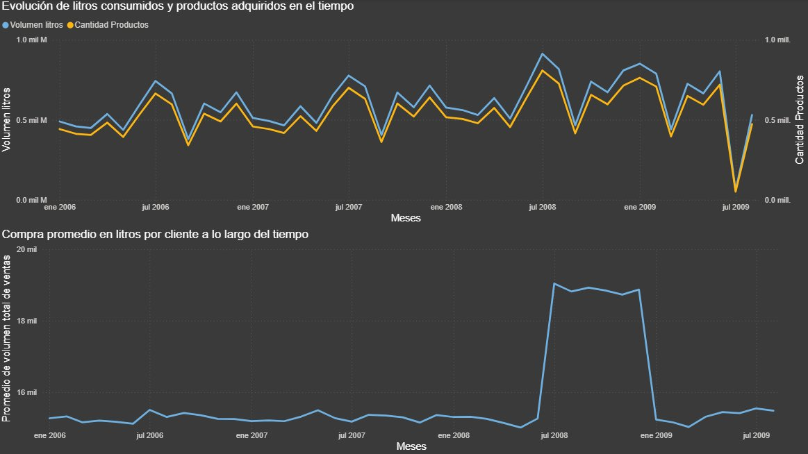
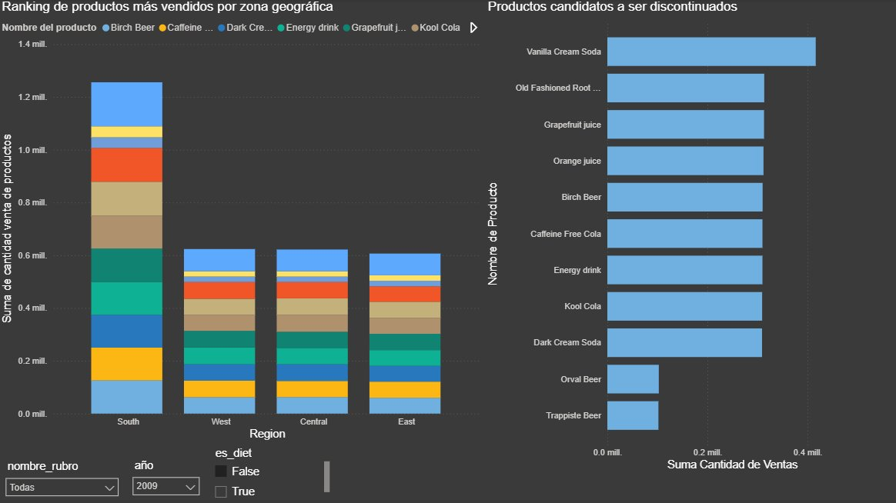
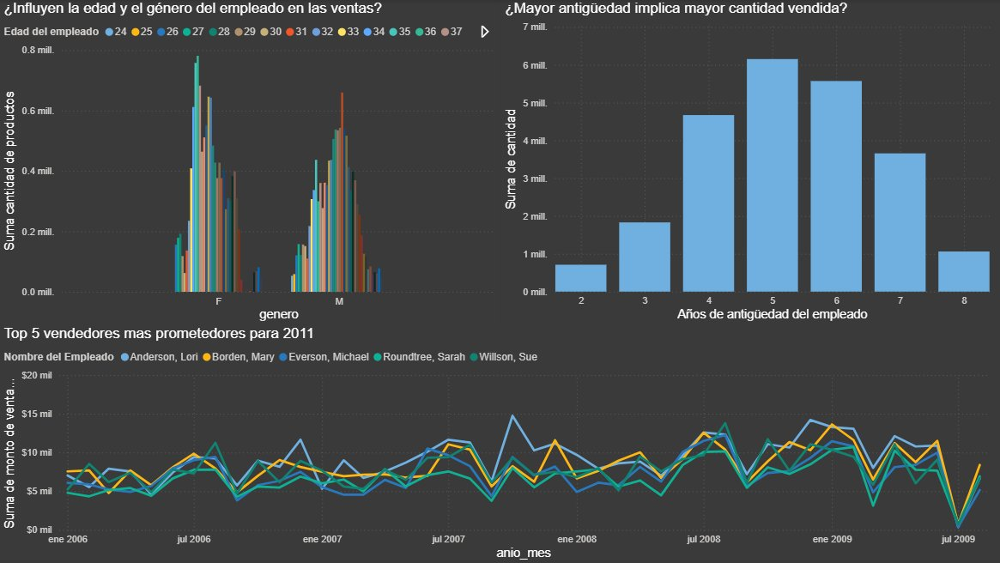

# Data Warehouse — The Drinking Company (TDC)

Solución completa de Business Intelligence para una empresa distribuidora de bebidas que opera en el mercado estadounidense. El proyecto abarca diseño dimensional, proceso ETL y dashboard gerencial con 17 reportes de negocio.

---

## El Problema

TDC acumuló datos de ventas en sistemas heterogéneos a lo largo de cuatro años: ventas históricas en SQL Server (2006–2008), ventas actuales en MySQL (2009), clientes en archivos XML, empleados en Excel, y movimientos de stock en archivos de texto plano. Cada área operaba con su propio sistema sin posibilidad de análisis cruzado.

La dirección necesitaba respuestas concretas: qué productos discontinuar, qué vendedores son más prometedores, si las bebidas diet estaban perdiendo popularidad, y cómo proyectar ventas para 2011. Ninguno de los sistemas existentes podía responder esas preguntas de forma integrada.

---

## Arquitectura

```
5 fuentes heterogéneas
    │
    ▼
Staging Area (STG_TDC)         ← SQL Server local, sin transformaciones
    │
    ▼
Data Warehouse (TDC_DW)        ← Modelo estrella, 6 dimensiones + 2 tablas de hechos
    │
    ▼
Dashboard Power BI             ← 17 reportes gerenciales, 9 páginas temáticas
```

**Stack:** SQL Server · SSIS (Visual Studio 2022) · Power BI Desktop

---

## Modelo Dimensional

El modelo sigue una arquitectura estrella con snowflake parcial en la dimensión de producto.

| Tabla | Descripción |
|---|---|
| `DIM_FECHA` | Calendario 2000–2009. Incluye columna `fecha_completa` (DATE) para Power BI |
| `DIM_CLIENTE` | 686 clientes (R=minorista, W=mayorista). Geografía desnormalizada |
| `DIM_EMPLEADO` | Empleados con fecha de ingreso y nacimiento para cálculos point-in-time |
| `DIM_PRODUCTO` | 42 productos con FK a `DIM_RUBRO` y `DIM_PRESENTACION` |
| `DIM_RUBRO` | Beer, Cola, Energy Drink, Juice, Soda |
| `DIM_PRESENTACION` | Volumen en cm³, tipo de envase (lata/botella) |
| `FCT_VENTAS` | **1.716.606 filas** — ventas históricas + actuales integradas |
| `FCT_STOCK` | **984 filas** — movimientos de entrada de stock 2002–2004 |

### Decisiones de diseño destacadas

**Campos point-in-time en FCT_VENTAS** — `edad_cliente`, `edad_empleado`, `antiguedad_empleado` y `grupo_etario` se calculan a la fecha exacta de cada venta, no en las dimensiones. Esto preserva el contexto histórico: un cliente que tenía 35 años en 2006 no aparece con 39 en registros de ese año.

**`grupo_etario` como VARCHAR** — almacenado como rango legible (`"20-39"`, `"40-50"`, etc.) en lugar de entero, para facilitar el análisis directo en Power BI sin lookups adicionales.

**Registros desconocidos con id=-1** — implementados en `DIM_CLIENTE`, `DIM_EMPLEADO` y `DIM_PRODUCTO` para manejar NULLs en la tabla de hechos sin perder filas de venta.

**Precios point-in-time** — cada venta usa el precio vigente a su fecha mediante `COALESCE` con subconsulta ordenada. Para ventas anteriores al primer registro de precios, se usa el precio más antiguo disponible.

**Stock como movimientos** — `FCT_STOCK` registra entradas de inventario tal como existen en la fuente. No se infiere stock acumulado ni se cruza con ventas dado que los períodos no se solapan (stock: 2002–2004, ventas: 2006–2009).

---

## ETL

El proceso ETL se implementó en SSIS con dos capas orquestadas por paquetes maestros.

`PKG_MASTER_STG` → carga las 11 tablas de staging desde las 5 fuentes  
`PKG_MASTER_DW` → ejecuta los 8 stored procedures de carga del DW en secuencia

Toda la lógica de limpieza y transformación vive en los stored procedures, no en los paquetes SSIS, para facilitar el mantenimiento y la reejecutabilidad.

---

## Dashboard — Hallazgos Principales



Las ventas muestran un patrón estacional consistente a lo largo de todo el período. El volumen en litros y la cantidad de productos adquiridos evolucionan de forma casi idéntica, lo que indica que no hubo cambios significativos en el mix de presentaciones a lo largo del tiempo.

---



La región South lidera en volumen de ventas. La distribución de rubros es homogénea entre regiones — no existen preferencias de producto significativas por zona geográfica. Orval Beer y Trappiste Beer son los candidatos claros a discontinuación, con ventas significativamente menores al resto del catálogo.

---



El género femenino supera al masculino en monto de ventas. Los rangos de mayor rendimiento son 34–41 años para mujeres y 41–49 para hombres. Los empleados con 4 a 6 años de antigüedad son los que mayor volumen venden — la experiencia intermedia es el punto óptimo de rendimiento.

---

**Otros hallazgos:**

- **Bebidas diet:** no están perdiendo popularidad de forma independiente. La caída de 2009 es proporcional para productos diet y no-diet por igual.
- **Bebidas en lata:** no muestran tendencia decreciente específica. Ambos envases siguen el mismo patrón general.
- **Pareto (clientes minoristas):** el principio 80/20 no se confirma. El 20% superior de clientes concentra solo el 28.5% del monto total — la distribución es homogénea.
- **Energy Drink:** septiembre es el mes de *menor* venta, no el pico. Los picos se concentran en junio–julio.
- **Proyección Q1 2011:** estabilización estimada en ~$525K mensuales con intervalo de confianza del 95%.

---

## Contenido del Repositorio

```
├── DW/
│   ├── TDC_DW_Create.sql     # DDL completo + 8 stored procedures
│   └── TDC_DW.bak            # Backup comprimido de la base de datos
├── SSIS/
│   └── TDC_ETL.zip           # Proyecto Visual Studio 2022 con todos los paquetes
├── PowerBI/
│   └── TDC_powerbi.pbix      # Dashboard con 17 reportes gerenciales
└── Informe/
    └── TP_Final_TDC.pdf      # Informe técnico completo
```
